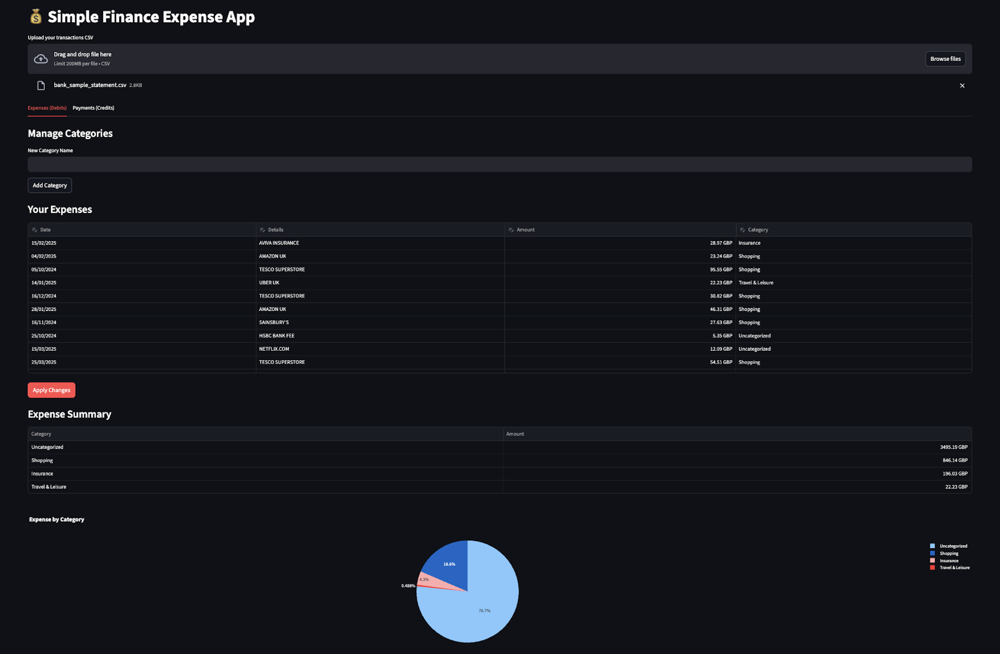
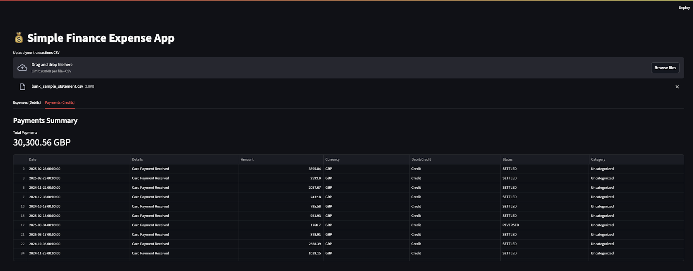

# Simple Finance Expense App 💰

A Streamlit application for categorizing and visualizing your financial transactions.

## Features ✨

- **Transaction Categorization**: Automatically categorize expenses based on keywords
- **Custom Categories**: Create and manage your own expense categories
- **Interactive Editing**: Update categories directly in the data table
- **Visual Analytics**: Pie charts and summary tables for expense breakdown
- **CSV Import**: Works with transaction exports from most banks

## Application Screenshots 📸

### Expenses Dashboard (Debits)

*Figure 1: Expense analysis showing categorized transactions, pie chart visualization, and category management*

### Payments Dashboard (Credits)

*Figure 2: Payments summary showing credit transactions and total amounts*

## How It Works 🛠️

1. Upload your bank transaction CSV file
2. The app automatically categorizes transactions based on keywords
3. Review and edit categories as needed
4. View visual breakdowns of your spending

## File Format Requirements 📄

Your CSV file should include these columns (names can vary):
- `Date` (in DD/Mmm/YYYY format, e.g., 01/Jan/2023)
- `Details` (transaction description)
- `Amount` (numeric value)
- `Debit/Credit` (should contain either "Debit" or "Credit")

## Installation ⚙️

1. Clone this repository:
   ```bash
   git clone https://github.com/yourusername/finance-expense-app.git
   cd finance-expense-app